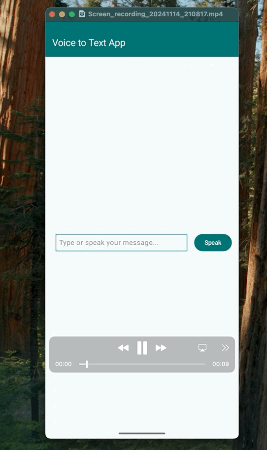

# Voice to Text | Kotlin | Android Jetpack Compose

## Tutorial
[Medium blog post](https://andresand.medium.com/voice-to-text-kotlin-android-jetpack-compose-3e4419dcbac3)

This code defines a Button composable in Jetpack Compose that, when clicked, initiates speech recognition. It first checks for the necessary audio recording permission and then launches the speech recognition activity.

This code creates a “Speak” button. When you tap it: The app checks if it has permission to record audio. If it has permission, it opens a speech recognition screen where you can speak. If it doesn’t have permission, it asks you for permission. The recognized speech is then typically handled in the speechRecognizerLauncher’s callback. GitHub code example.

## YouTube video
[Watch the video on YouTube](https://www.youtube.com/shorts/84Z8KAQkNg4)

## Code
[Main logic](https://github.com/AndreSand/VoiceToText/blob/main/app/src/main/java/com/android/example/voicetotext/MainActivity.kt)